# 📚 Bibliosmia - Online Bookstore

**Bibliosmia** is an online bookstore developed as a third-year university web project. Built from scratch using HTML, CSS, PHP, and Laravel, this platform provides a seamless experience for both customers and administrators. Users can browse books, add them to their cart, and complete purchases, while administrators can manage the bookstore efficiently through the admin panel.

## 🚀 Features

### 🛍 User Section
- Browse books by categories,publishers or writer wise.
- Search for books
- Add books to the cart
- Checkout process
- User authentication (registration & login)

### 🔑 Admin Section
- Add,update, and delete new categories, publishers and writers.
- Add, update, and delete books
- View and manage orders
- Check the available stock of books.

### 🛒 Cart System
- Add books to the cart
- Update or remove items from the cart
- Checkout

## 🛠 Tech Stack
- **Frontend:** HTML, CSS
- **Backend:** PHP, Laravel
- **Database:** MySQL (using phpMyAdmin via XAMPP)

## 📸 Screenshots


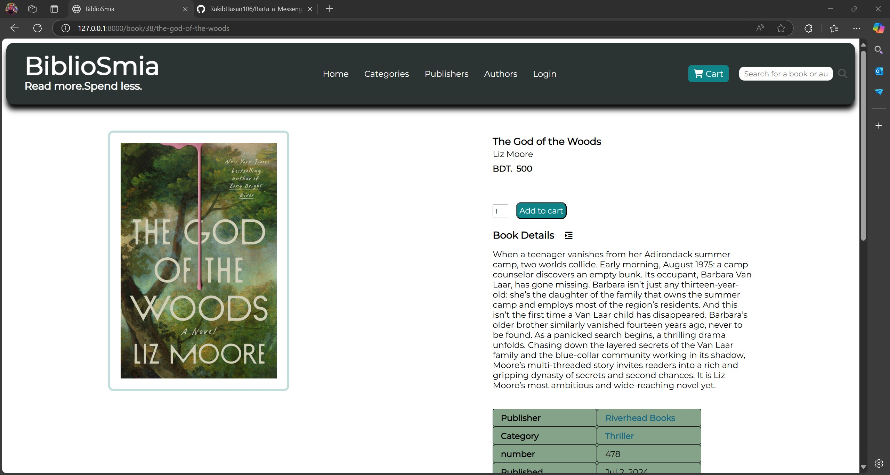
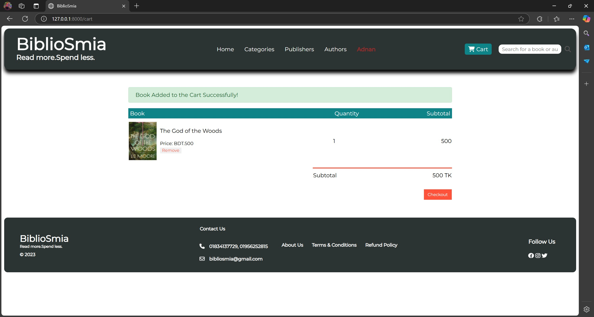

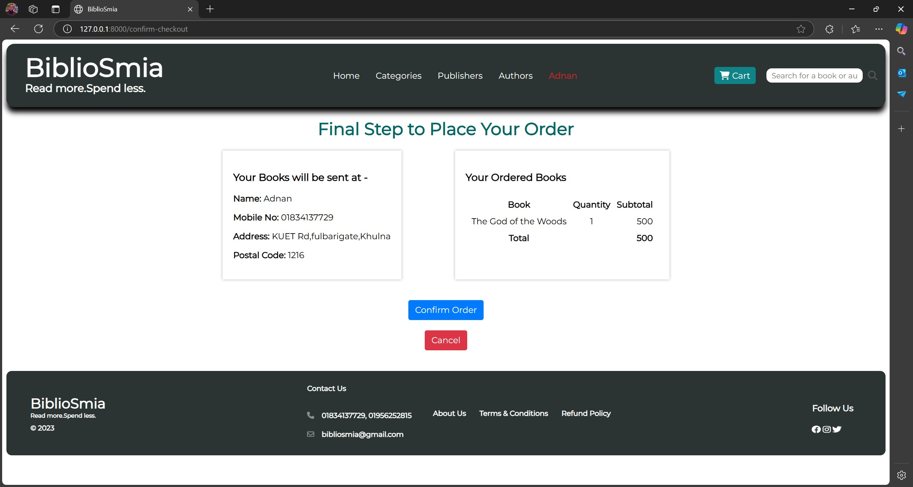
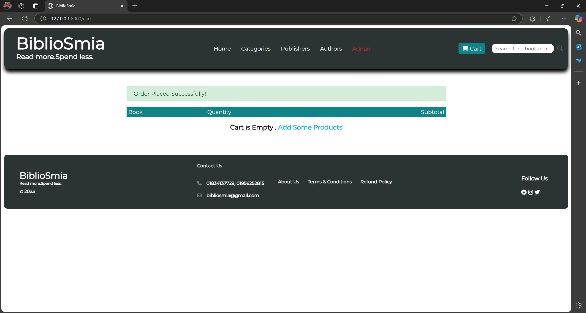

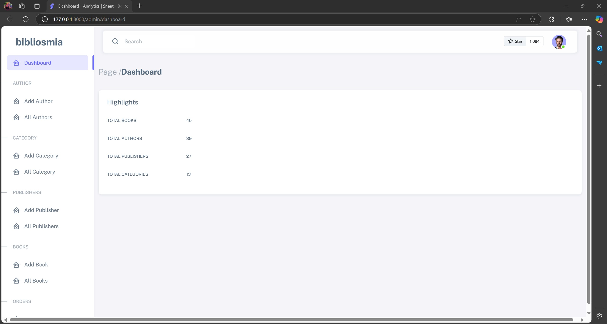
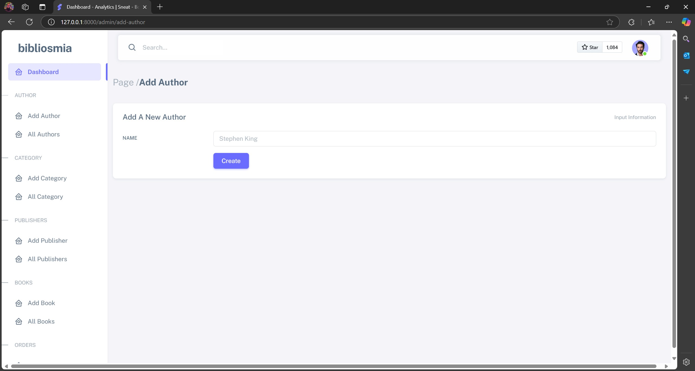
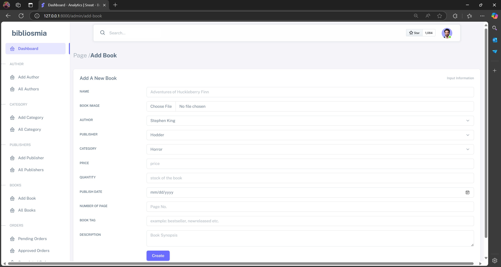
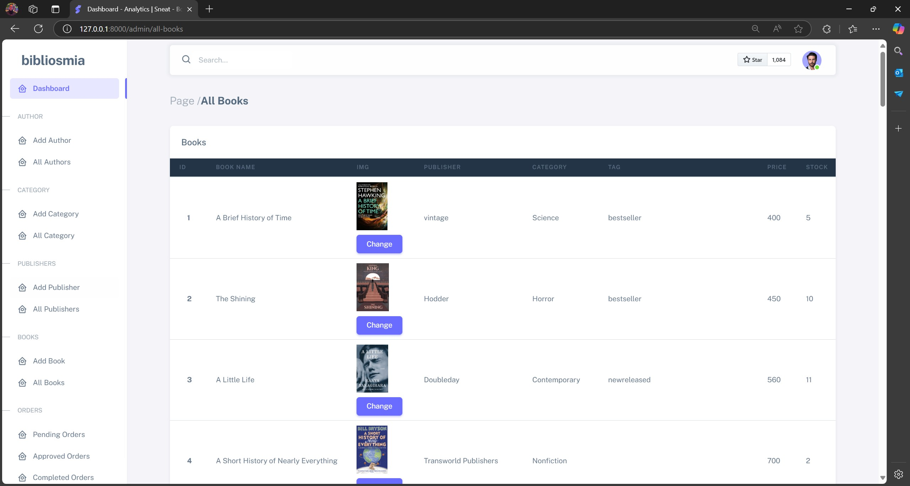
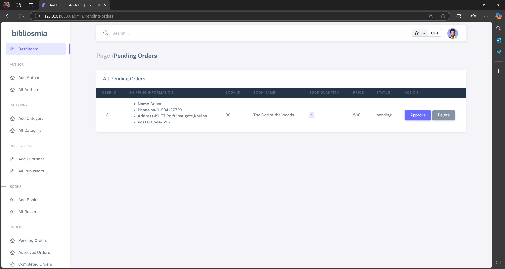
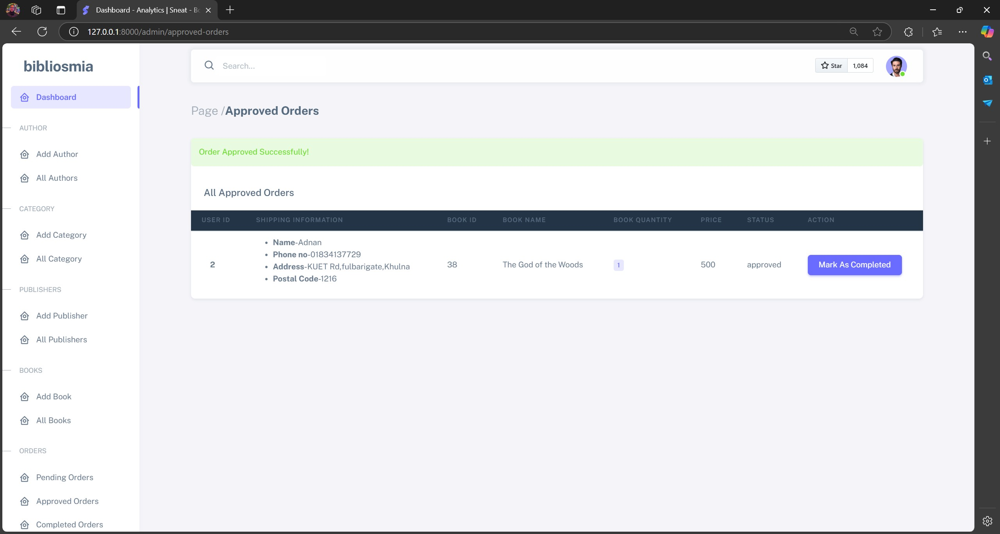
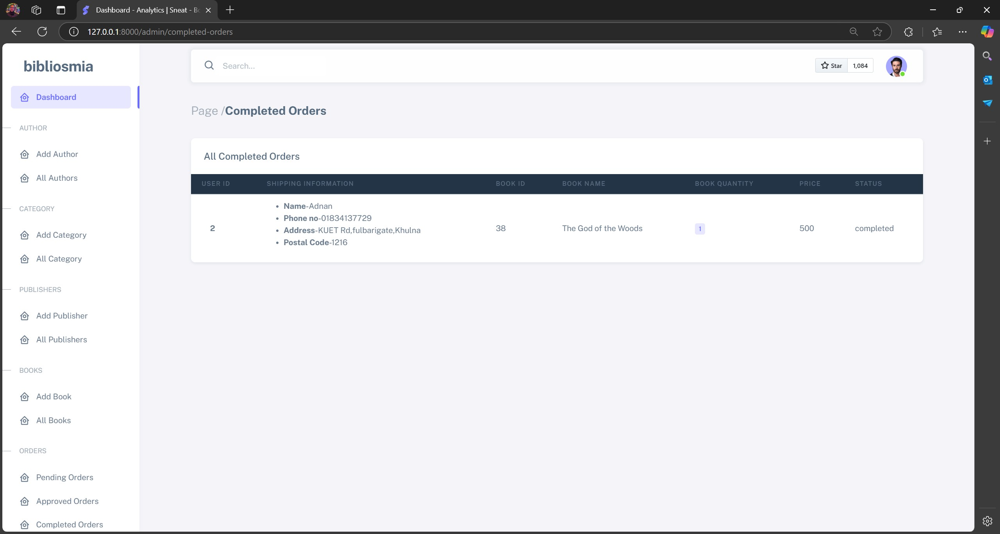
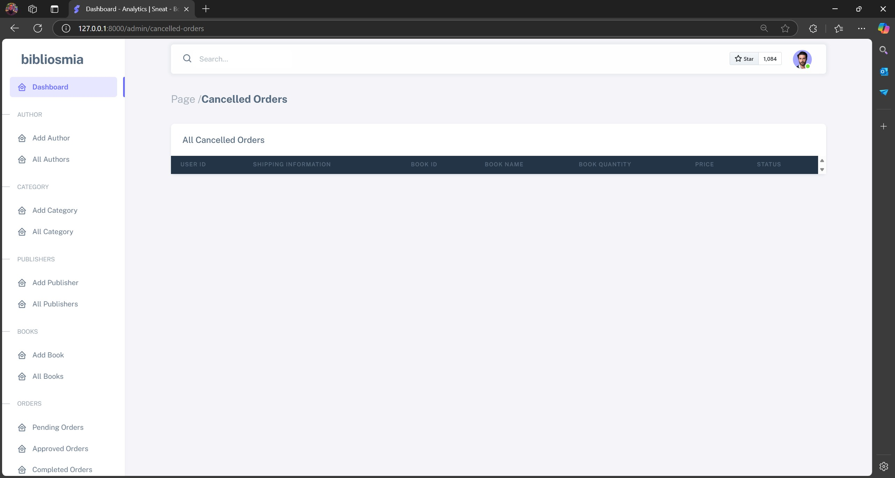


## 🛠 Installation & Setup

### 1️⃣ Clone the Repository

```sh
git clone https://github.com/RakibHasan106/bibliosmia_2.git
cd bibliosmia_2
```

### 2️⃣ Install Dependencies (Do these sequentially)
    
    Download and install xampp (`https://www.apachefriends.org/download.html`)
    Download and install composer (`https://getcomposer.org/download/`)
    Open Xampp and start apache and mysql server

### 3️⃣ Configure Environment
As the `.env` file is excluded from the version control, you have to generate a new `.env` file and generate a new key for the laravel app.

```sh
cp .env.example .env
php artisan key:generate
```
After that set up database credentials in `.env`:

```env
DB_DATABASE=bibliosmia
DB_USERNAME=root
DB_PASSWORD=
```

Now if you want to recreate the databases, follow from step 4️⃣. But if you don't want the hassle and happy to use my already created database, Go to step 7️⃣.

### 4️⃣ Create Database
*	Go to localhost/phpmyadmin (make sure the apache and mysql servers are turned on in the xampp app).
*	Click on SQL from the top of the page 
*	Type the following query:  

```sh
CREATE DATABASE bibliosmia_db and hit GO.
```

*	The database named bibliosmia_db is now created.


### 5️⃣ Migration
Now run migration (As the tables mentioned in the laravel app is not created in the database yet).

```sh
php artisan migrate:fresh --seed
```
This will create all the necessary tables and an admin with the following credentials:

```env
    Name: ‘Admin’
	Email:  ‘admin@bibliosmia.com’
	Password:  ‘password’

```
### 6️⃣ Serve

```sh
php artisan serve
```

Now, visit **http://127.0.0.1:8000** in your browser. 🎉
Login into the admin panel using the admin's credentials to have all the necessary admin's access , delete, edit books and other things.

## 📦 Database Restore & Restore

### 7️⃣♻️ Restore MySQL Database
1. Go to (`http://localhost/phpmyadmin/`) in your browser.
2. Create a new database named `bibliosmia_db`
3. Click **Import**, choose the saved `.sql` file from `database_backup/biliosmi_db.sql` , and upload it.

Now You can login using the credentials as mentioned in the step 3️⃣.

### 8️⃣🔄 Backup MySQL Database (Using phpMyAdmin)
1. Open **phpMyAdmin** (`http://localhost/phpmyadmin`)
2. Select the **bibliosmia_db** database
3. Click **Export** > Select **Quick** and **SQL** format
4. Click **Go** and save the `.sql` file


## 🤝 Contributing
Feel free to fork this repository, submit issues, or make pull requests!

## 📄 License
This project is **open-source** and available under the **MIT License**.

---
🚀 *Built with ❤️ using Laravel and MySQL*
