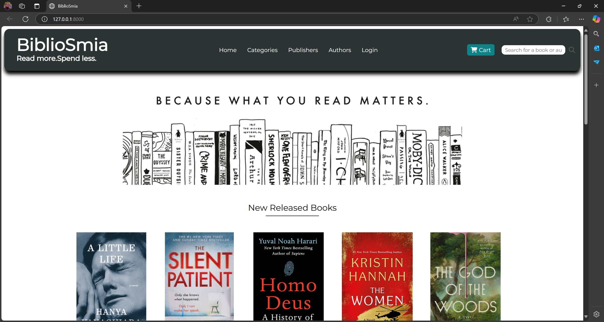

# 📚 Bibliosmia - Online Bookstore

**Bibliosmia** is an online bookstore developed as a third-year university web project. Built from scratch using HTML, CSS, PHP, and Laravel, this platform provides a seamless experience for both customers and administrators. Users can browse books, add them to their cart, and complete purchases, while administrators can manage the bookstore efficiently through the admin panel.

## 🚀 Features

### 🛍 User Section
- Browse books by categories,publishers or writer wise.
- Search for books
- Add books to the cart
- Checkout process
- User authentication (registration & login)

### 🔑 Admin Section
- Add,update, and delete new categories, publishers and writers.
- Add, update, and delete books
- View and manage orders
- Check the available stock of books.

### 🛒 Cart System
- Add books to the cart
- Update or remove items from the cart
- Checkout

## 🛠 Tech Stack
- **Frontend:** HTML, CSS
- **Backend:** PHP, Laravel
- **Database:** MySQL (using phpMyAdmin via XAMPP)

## 📸 Screenshots


```md



```

## 🛠 Installation & Setup

### 1️⃣ Clone the Repository

```sh
git clone https://github.com/yourusername/bibliosmia.git
cd bibliosmia
```

### 2️⃣ Install Dependencies (Do these sequentially)
    
    #### Download and install xampp
    #### Download and install composer
    #### Open Xampp and start apache and mysql server

### 3️⃣ Configure Environment
As the `.env` file is excluded from the version control, you have to generate a new `.env` file and generate a new key for the laravel app.

```sh
cp .env.example .env
php artisan key:generate
```
After that set up database credentials in `.env`:

```env
DB_DATABASE=bibliosmia
DB_USERNAME=root
DB_PASSWORD=
```

Now if you want to recreate the databases Do the Following. But if you don't want the hassle and happy to use my already created database, Go to step 7️⃣.

### 4️⃣ Create Database
*	Go to localhost/phpmyadmin (make sure the apache and mysql servers are turned on in the xampp app).
*	Click on SQL from the top of the page 
*	Type the following query:  

```sh
CREATE DATABASE bibliosmia_db and hit GO.
```

*	The database named bibliosmia_db is now created.


### 5️⃣ Migration
Now run migration (As the tables mentioned in the laravel app is not created in the database yet).

```sh
php artisan migrate:fresh --seed
```
This will create all the necessary tables and an admin with the following credentials:

```env
    Name: ‘Admin’
	Email:  ‘admin@bibliosmia.com’
	Password:  ‘password’

```
### 6️⃣ Serve

```sh
php artisan serve
```

Now, visit **http://127.0.0.1:8000** in your browser. 🎉
Login into the admin panel using the admin's credentials to have all the necessary admin's access , delete, edit books and other things.

## 📦 Database Restore & Restore

### 7️⃣♻️ Restore MySQL Database
1. Go to (`http://localhost/phpmyadmin/`) in your browser.
2. Create a new database named `bibliosmia_db`
3. Click **Import**, choose the saved `.sql` file from `database_backup/biliosmi_db.sql` , and upload it.

Now You can login using the credentials as mentioned in the step 3️⃣.

### 8️⃣🔄 Backup MySQL Database (Using phpMyAdmin)
1. Open **phpMyAdmin** (`http://localhost/phpmyadmin`)
2. Select the **bibliosmia_db** database
3. Click **Export** > Select **Quick** and **SQL** format
4. Click **Go** and save the `.sql` file


## 🤝 Contributing
Feel free to fork this repository, submit issues, or make pull requests!

## 📄 License
This project is **open-source** and available under the **MIT License**.

---
🚀 *Built with ❤️ using Laravel and MySQL*
